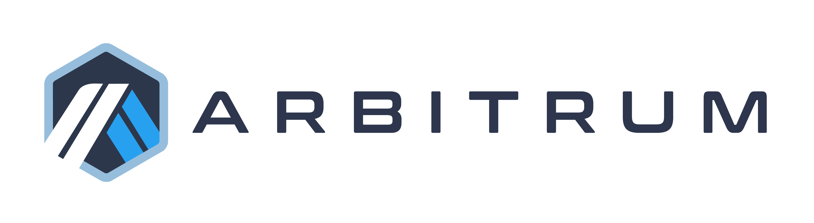

<p align="center"></p>

# Arbitrum Token Bridge Contracts

The Arbitrum Token Bridge is a decentralized application that uses [Nitro's](https://github.com/OffchainLabs/nitro) arbitrary cross-chain messaging system to implement an ERC20 token bridge between an EVM compatible base-chain and an Arbitrum chain.

All public Arbitrum chains include a [canonical token bridge deployment](https://developer.arbitrum.io/useful-addresses#token-bridge).

The Token Bridge includes "Gateway" contracts — pairs of contracts that implement a particular token-bridging flow — as well as "Gateway Router" contracts, which map tokens to their respective gateways.

See the [developer documentation](https://developer.arbitrum.io/asset-bridging) for more info.

See security audit reports [here](./audits).

This repository is offered under the Apache 2.0 license. See [LICENSE](https://github.com/OffchainLabs/token-bridge-contracts/blob/main/LICENSE) for details.

## Deployment
Check [this doc](./docs/deployment.md) for instructions on deployment and verification of token bridge.

## Pre-commit Hook

A local CI pre-commit hook lives in `.githooks/pre-commit`. To install it:

```bash
git config core.hooksPath .githooks
```

The hook runs `scripts/ci-local.sh` with optionally a full e2e suite.

### Environment Variables

| Variable | Default | Description |
|---|---|---|
| `SKIP_LOCAL_CI` | `0` | Set to `1` to bypass the entire hook or you can simply use --no-verify flag |
| `RUN_E2E` | `0` | Set to `1` to run the e2e suite in the background, you will need to have docker installed and running to use the nitro-testnode |

## Contact

Discord: [Arbitrum](https://discord.com/invite/5KE54JwyTs)

Twitter: [Arbitrum](https://twitter.com/arbitrum)
